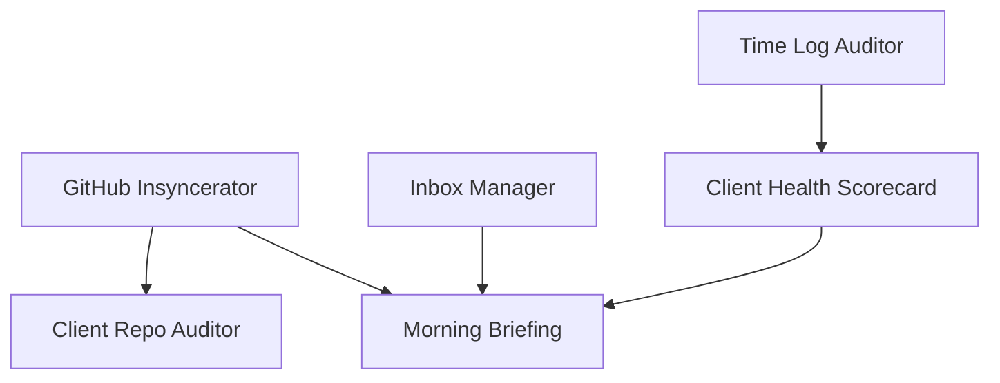

## Overview

The JRE Notion Workers support an **11-agent custom automation system** that manages everything from email triage to GitHub syncing to weekly reporting. These workers enforce governance rules, reduce agent overhead, and make machine-to-machine coordination reliable across the fleet.

<Info>
  These workers are **infrastructure for agents**, not agents themselves. They provide reliable, governed APIs that agents call to perform Notion operations.
</Info>

## What Are Agents?

Agents are autonomous TypeScript programs that:

- Run on a schedule or in response to events
- Perform specialized tasks (triage email, sync GitHub, audit repos, generate reports)
- Write structured "digest" pages to Notion to record their work
- Hand off to other agents when they encounter work outside their scope

**The workers make agents simpler** - instead of each agent implementing Notion page creation, status parsing, and handoff logic, they call three well-tested workers.

## The Three Workers

<CardGroup cols={3}>
  <Card title="write-agent-digest" icon="pen-to-square">
    Creates a governance-compliant digest page with the correct schema, status line, and sections
  </Card>
  
  <Card title="check-upstream-status" icon="magnifying-glass">
    Finds the most recent digest for a given agent and returns parsed status
  </Card>
  
  <Card title="create-handoff-marker" icon="hand-holding-hand">
    Creates a handoff record (and optionally a Task) when one agent escalates to another
  </Card>
</CardGroup>

## Agent Workflow Pattern

Every agent follows this pattern:

<Steps>
  <Step title="Check upstream">
    At run start, call **check-upstream-status** for any upstream agents you depend on.
    
    ```typescript
    const githubStatus = await checkUpstreamStatus({
      agent_name: 'github-insyncerator'
    });
    
    if (githubStatus.age_hours > 24) {
      // Include data_completeness_notice in your digest
      dataCompletenessNotice = 'GitHub data is stale (last sync 36 hours ago)';
    }
    ```
    
    Use the returned `data_completeness_notice` and `degraded` status in your own digest.
  </Step>
  
  <Step title="Do work">
    Perform your agent's core logic:
    - Triage emails
    - Sync GitHub repos
    - Audit client repositories
    - Generate reports
    - etc.
    
    Collect results into structured sections and flagged items.
  </Step>
  
  <Step title="Handoff if needed">
    When you encounter work outside your scope, call **create-handoff-marker**:
    
    ```typescript
    const handoff = await createHandoffMarker({
      source_agent: 'inbox-manager',
      target_agent: 'personal-ops-manager',
      reason: 'Personal email requires manual review',
      create_task: true,
      task_title: 'Review personal email from ...',
      context_url: 'https://notion.so/...'
    });
    
    // Include handoff.escalations_block in your digest
    ```
    
    The worker handles circuit breakers and re-escalation caps.
  </Step>
  
  <Step title="Write digest">
    At run end, call **write-agent-digest** with your structured output:
    
    ```typescript
    const result = await writeAgentDigest({
      agent_name: 'inbox-manager',
      status_type: 'sync',
      degraded: false,
      sections: [...],
      flagged_items: [...],
      actions_taken: {
        created_tasks: ['Task-123'],
        updated_tasks: [],
        no_tasks_created: false
      },
      data_completeness_notice: dataCompletenessNotice
    });
    
    console.log(`Created digest: ${result.page_url}`);
    ```
    
    The worker creates the page with the correct schema, status line, title, and section ordering.
  </Step>
</Steps>

## The 11 Agents

Here's the complete roster, with the digest title pattern each agent uses:

| Agent | Digest Title Pattern | Target Database | Purpose |
|-------|---------------------|-----------------|----------|
| **Inbox Manager** | Email Triage | docs | Triages incoming email, creates tasks, flags urgent items |
| **Personal Ops Manager** | Personal Triage | home_docs | Handles personal/family items, coordinates with Inbox Manager |
| **GitHub Insyncerator** | GitHub Sync | docs | Syncs GitHub repos, PRs, issues, and notifications |
| **Client Repo Auditor** | Client Repo Audit | docs | Audits client repositories for code quality, security, and best practices |
| **Docs Librarian** | Docs Quick Scan, Docs Cleanup Report | docs | Maintains Notion documentation, archives stale pages |
| **VEP Weekly Reporter** | VEP Weekly Activity Report | docs | Generates weekly reports for VEP (Very Engaged Person) clients |
| **Home & Life Watcher** | Home & Life Weekly Digest | home_docs | Tracks home maintenance, family events, personal goals |
| **Template Freshness Watcher** | Setup Template Freshness Report | docs | Monitors setup templates and checks for outdated instructions |
| **Time Log Auditor** | Time Log Audit | docs | Audits time tracking entries for completeness and accuracy |
| **Client Health Scorecard** | Client Health Scorecard | docs | Generates health scores for all active clients |
| **Morning Briefing** | Morning Briefing | docs | Synthesizes overnight activity from all agents into a single morning digest |

### Target Databases

<CardGroup cols={2}>
  <Card title="docs" icon="file-lines">
    **Docs Database** - Work-related digests (email triage, GitHub sync, client audits, reports)
    
    Most agents write here.
  </Card>
  
  <Card title="home_docs" icon="house">
    **Home Docs Database** - Personal digests (personal triage, home & life tracking)
    
    Used by Personal Ops Manager and Home & Life Watcher.
  </Card>
</CardGroup>

The `write-agent-digest` worker determines the target database from the `agent_name` using the mapping in `src/shared/agent-config.ts`.

## Governance Rules Enforced by Code

The workers enforce consistency across all agent digests. Agents don't need to remember these rules - the workers handle them:

### 1. Status Lines

<Accordion title="Machine-readable status format">
  Every digest includes a status line that other agents can parse:
  
  ```
  Status: ✅ Sync complete | ⚠️ Degraded snapshot | ❌ Report failed
  ```
  
  Format: `{emoji} {Status Type} {status verb}` where:
  - Emoji: ✅ (success), ⚠️ (degraded), ❌ (failure)
  - Status Type: Sync, Snapshot, or Report
  - Status verb: "complete", "degraded", "failed"
  
  Agents pass `status_type` and `degraded` - the worker generates the line.
</Accordion>

### 2. Page Titles

<Accordion title="Consistent title formatting">
  **Normal runs:**
  ```
  ✅ Email Triage — March 4, 2026
  ```
  
  **Degraded runs:**
  ```
  Email Triage ERROR — March 4, 2026
  ```
  
  Notice: degraded runs use "ERROR" in the title and omit the emoji. This makes failed digests immediately visible.
  
  Agents only pass `agent_name` and `degraded` - the worker constructs the title from the mapping table and run timestamp.
</Accordion>

### 3. Heartbeat

<Accordion title="'No actionable items' signal">
  When a digest has:
  - No flagged items
  - No tasks created
  - No handoffs
  
  The worker adds:
  ```
  Heartbeat: no actionable items
  ```
  
  This tells the Morning Briefing agent: "I ran successfully and found nothing urgent." Without this, the Morning Briefing can't distinguish healthy silence from a failed run.
</Accordion>

### 4. Flagged Items

<Accordion title="Every flagged item must have a task or reason">
  The worker validates that every `FlaggedItem` has either:
  - `task_link` (URL to a Notion task)
  - `no_task_reason` (explanation of why no task was created)
  
  Invalid input is rejected:
  ```json
  {
    "success": false,
    "error": "Flagged item 'Urgent client email' must have task_link or no_task_reason"
  }
  ```
  
  This ensures every urgent item is either tracked or explicitly documented as not needing tracking.
</Accordion>

### 5. Actions Taken

<Accordion title="Always rendered section">
  Every digest includes an "Actions Taken" section with:
  - Created Tasks: `[Task-123](https://notion.so/...), [Task-456](...)`
  - Updated Tasks: `[Task-789](...)`
  - Or: "No Tasks Created" if `no_tasks_created: true`
  
  Agents pass `actions_taken: { created_tasks, updated_tasks, no_tasks_created }` - the worker formats it consistently.
</Accordion>

### 6. Handoff Circuit Breaker

<Accordion title="Prevents duplicate handoffs">
  `create-handoff-marker` enforces:
  
  **Circuit breaker:** No duplicate handoff for the same `source → target` within 7 days.
  
  ```json
  {
    "success": false,
    "error": "Circuit breaker: handoff from inbox-manager to personal-ops-manager exists within 7 days",
    "last_handoff_date": "2026-03-02"
  }
  ```
  
  This prevents escalation loops where two agents keep handing the same issue back and forth.
</Accordion>

### 7. Escalation Cap

<Accordion title="Maximum 2 escalations in 7 days">
  `create-handoff-marker` also enforces:
  
  **Re-escalation cap:** Maximum 2 escalations in the same direction within 7 days.
  
  After the cap is hit:
  ```json
  {
    "success": true,
    "needs_manual_review": true,
    "escalations_block": "...",
    "task_created": false,
    "message": "Re-escalation cap reached (2 in same direction within 7 days). Manual review required."
  }
  ```
  
  A handoff record is created, but no new task. This signals: "Something is broken - human needs to intervene."
</Accordion>

## Status Types and Run Semantics

Agents must specify a `status_type` that describes the nature of their run:

<CardGroup cols={3}>
  <Card title="sync" icon="arrows-rotate">
    **Real-time integration**
    
    Syncs external data (email, GitHub, etc.) to Notion. Expected to run frequently.
    
    Examples: Email Triage, GitHub Sync
  </Card>
  
  <Card title="snapshot" icon="camera">
    **Point-in-time capture**
    
    Records the current state of something. Scheduled runs (daily, weekly).
    
    Examples: Client Repo Audit, Time Log Audit
  </Card>
  
  <Card title="report" icon="chart-line">
    **Analysis/summary**
    
    Analyzes data and generates insights. Often runs weekly or monthly.
    
    Examples: VEP Weekly Activity Report, Client Health Scorecard, Morning Briefing
  </Card>
</CardGroup>

**Why it matters:**

- Morning Briefing uses `status_type` to decide which digests to include
- Downstream agents use `status_type` to interpret staleness (a "sync" that's 10 hours old is more concerning than a "report" that's 10 hours old)
- The worker generates different status verbs based on type ("Sync complete" vs "Report complete")

## Data Completeness Notices

When upstream data is stale or failed, agents should include a `data_completeness_notice` in their digest:

```typescript
const githubStatus = await checkUpstreamStatus({
  agent_name: 'github-insyncerator'
});

let dataCompletenessNotice: string | undefined;
if (githubStatus.degraded) {
  dataCompletenessNotice = `GitHub data is stale or failed. Last run: ${githubStatus.last_run_time}.`;
}

await writeAgentDigest({
  // ...
  data_completeness_notice: dataCompletenessNotice
});
```

The worker renders this at the top of the digest with a warning icon:

> ⚠️ **Data Completeness Notice**  
> GitHub data is stale or failed. Last run: March 3, 2026 at 10:30 PM CT.

**This is critical for trust** - downstream agents and humans need to know when data might be incomplete.

## Agent Coordination Patterns

### Dependency Chains

Some agents depend on others:



**Client Repo Auditor** depends on **GitHub Insyncerator** - it needs fresh repo data.  
**Morning Briefing** depends on **all agents** - it synthesizes their output.

### Handoff Chains

Some agents escalate to others:

```
Inbox Manager → Personal Ops Manager (personal emails)
Docs Librarian → <human> (pages needing manual review)
Client Repo Auditor → <human> (security issues)
```

Handoffs are **one-way escalations**. The source agent is saying: "I found something outside my scope; you handle it."

### Morning Briefing Integration

The **Morning Briefing** agent is special - it reads digests from all other agents and synthesizes them into a single daily digest.

It uses:
- `check-upstream-status` to find the latest digest from each agent
- Status lines to determine success/failure/degraded
- Heartbeat signals to distinguish healthy silence from failure
- Flagged items to pull urgent items into the briefing
- Actions Taken to summarize task creation across agents

**The Morning Briefing is the human interface to the agent system** - you read one page each morning instead of 10.

## Runtime and Toolchain

Agents are written in **TypeScript** and run in:

- **Node.js ≥22** (production)
- **Bun ≥1.1** (local development)

<Warning>
  **Bun is for local dev only.** Agents run in Node in production. Never use Bun-specific APIs (`Bun.file()`, `Bun.serve()`, etc.) in agent source code.
</Warning>

### Code Standards

<AccordionGroup>
  <Accordion title="Naming conventions">
    - Files: `kebab-case.ts`
    - Functions/variables: `camelCase`
    - Types/interfaces: `PascalCase`
    - Constants: `SCREAMING_SNAKE_CASE`
  </Accordion>
  
  <Accordion title="Type safety">
    - `strict: true` in `tsconfig.json`
    - No `any` - use `unknown` then narrow
    - No non-null assertions (`!`) on API responses
    - All async functions should have explicit return types
  </Accordion>
  
  <Accordion title="Module system">
    - ESM (`"type": "module"` in `package.json`)
    - Use `.js` extensions in import paths (NodeNext)
    
    ```typescript
    // ✅ Correct
    import { getNotionClient } from "../shared/notion-client.js";
    
    // ❌ Wrong
    import { getNotionClient } from "../shared/notion-client";
    ```
  </Accordion>
</AccordionGroup>

## Scope and Boundaries

### What Workers Read

- **Docs database** (for digest lookup and write targets)
- **Home Docs database** (for digest lookup and write targets)
- Nothing else

### What Workers Write

- **Docs database** (agent digest pages)
- **Home Docs database** (agent digest pages)
- **Tasks database** (handoff tasks via `create-handoff-marker`)
- Nothing else

### What Workers Do NOT Do

- Read or write pages outside declared database IDs
- Make HTTP requests to external services (except Notion API)
- Access the filesystem (workers are stateless)
- Modify configuration or database schemas

<Note>
  **Governance rule:** No worker may read or write outside its declared scope without an explicit governance review. This ensures agents can't accidentally affect production data they shouldn't touch.
</Note>

## Next Steps

<CardGroup cols={2}>
  <Card title="Architecture" icon="sitemap" href="/concepts/architecture">
    Understand the layered architecture and data flow
  </Card>
  
  <Card title="API Reference" icon="code" href="/api/write-agent-digest">
    Detailed API documentation for each worker
  </Card>
  
  <Card title="Workers Platform" icon="server" href="/concepts/workers">
    Learn about the Notion Workers runtime
  </Card>
  
  <Card title="Getting Started" icon="rocket" href="/installation">
    Set up your development environment
  </Card>
</CardGroup>